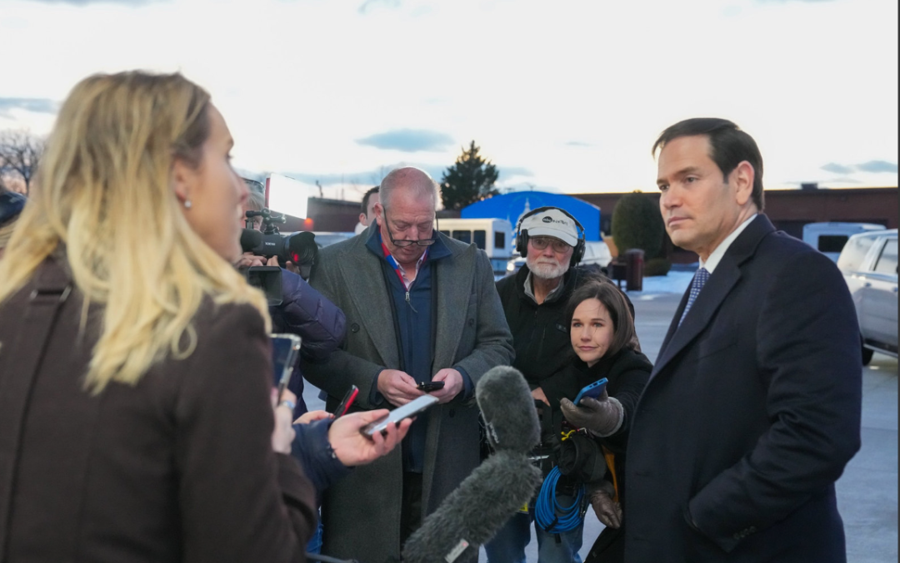

# 卢比奥慕安会煽情：美国永远是“欧洲的孩子”！

> 发布日期: 2026-02-15

2026年2月14日上午，第62届慕尼黑安全会议（MSC 2026）主舞台，美国国务卿马尔科·鲁比奥（Marco Rubio）发表题为《The U.S. in the World》的主旨演讲。这不是一次普通的礼节性致辞，而是特朗普第二任期美国对欧洲发出的最清晰、最具情感张力的信号：我们仍是“一家人”，但这家人必须一起醒来、一起自强，否则就只能看着西方文明被“管理式衰落”。

官方完整讲话原文链接

（美国国务院实时发布）：https://www.state.gov/releases/office-of-the-spokesperson/2026/02/secretary-of-state-marco-rubio-at-the-munich-security-conference

慕安会官方及国务院YouTube完整视频

：https://www.youtube.com/watch?v=yOjBJ89aeXA（国务院官方）https://securityconference.org/en/msc-2026/agenda/（搜索“The U.S. in the World”）

1. 演讲核心：从“历史终结论”的幻觉中醒来

鲁比奥用长达近30分钟的演讲，系统拆解了过去30年西方共同犯下的“愚蠢错误”：

无节制自由贸易 → 去工业化、供应链被对手控制；

主权外包给国际机构 → 福利国家膨胀，国防能力萎缩；

“气候崇拜”能源政策 → 民众能源贫困，对手却用化石燃料勒索；

大规模无序移民 → 社会凝聚力、文化连续性、人民未来受到威胁。

他直言，这些不是“不可避免的历史进程”，而是“有意识的政策选择”。最刺耳的一句是：

“我们不想当西方文明‘有礼貌的看守人’，看着它被管理式衰落（managed decline）。”

但他没有用去年副总统万斯那种“炮轰式”语气，而是包裹在浓烈的文化情感里：

“对我们美国人来说，家可能在西半球，但我们永远是欧洲的孩子（we will always be a child of Europe）。”

“我们属于一起（We belong together）……我们是同一西方文明的继承者，共享基督教信仰、文化遗产、历史记忆和战场上的鲜血。”

全场起立鼓掌。纽约时报、CNN、NPR、Atlantic Council等西方主流媒体一致评价：

语气比2025年万斯演讲“温和得多、温暖得多”

，但核心政策主张

完全没有后退

。

2. 欧洲听到了什么？松一口气，但更清醒地要“战略自主”

根据现场报道：

欧盟委员会主席冯德莱恩当场说“非常安心”（very much reassured）。

英国首相斯塔默：欧洲必须“靠自己两条腿站立”，别陷入“自满的温水浴”。

德国总理默茨等领导人也承认语气好多了。

但几乎所有欧洲官员在私下和后续表态中都强调：

我们听懂了，美国不会再无限买单

。Atlantic Council专家直言，这是一场“魅力攻势+施压结合”的特朗普2.0版本——用文明情感牌安抚，同时把账单和责任推给欧洲。

慕安会2026年度报告《Under Destruction》把当前全球秩序描述为正被“破坏性政治”摧毁，欧洲焦虑感拉满。鲁比奥的演讲恰恰把同一现实包装成了“共同复兴”。

3. 我的深度分析与观点

这是一次罕见的“文明现实主义”宣言。

鲁比奥把辩论从“自由国际秩序 vs 民族主义”拉回到更根本的层面：

西方文明到底要不要继续存在？

他反复强调“军队不是为抽象概念而战，而是为人民、为国家、为生活方式而战”，这在慕安会这种高度“规则导向”的场合极其罕见，却异常刺耳——因为它直接戳破了过去30年“历史终结论”的最大谎言：以为全球化、开放边境、多边机构就能自动带来永久和平与繁荣。

我认为他说对了大部分。

欧洲（以及美国自己）过去确实陷入了一种“文明自杀式”的自恋：一边高喊“多元包容”，一边让本国工人阶级失业、让本土文化被稀释、让关键技术与资源被战略对手控制。鲁比奥提到的“civilizational erasure”（文明抹除）不是夸张修辞，而是正在发生的现实——从瑞典某些街区到法国郊区，再到美国边境城市，都能看到证据。拒绝正视这一点，才是真正的危险。

但我也看到风险。

把“西方文明”作为核心叙事，容易被误读为文化战争升级，甚至被极右翼借用（已有欧洲评论家指出，鲁比奥的某些表述听起来像德国AfD的语言）。更重要的是，特朗普政府必须用实际行动证明：美国不是要“甩锅”，而是真的愿意和一个更强大的欧洲共同竞争中国、俄罗斯和全球南方。如果只是嘴上说“我们属于一起”，行动上却继续关税战、能源战、供应链脱钩，那欧洲的“战略自主”就会加速变成“战略分离”——这对谁都不是好事。

最关键的信号是：后冷战时代的“免费午餐”彻底结束了。

无论鲁比奥语气多温和，核心意思只有一句话：

欧洲必须自强，美国愿意一起，但不会再单方面买单

。这对欧洲是痛苦却必要的“成人礼”。过去几年欧洲在国防、能源、工业上的拖延症，已经到了必须还债的时候。法国、德国、波兰如果能借此机会真正整合国防工业、增加军费、控制边境，那西方的整体实力反而会比过去更强。

结语：一场“温柔的革命”

鲁比奥在慕尼黑没有宣布新冷战，也没有宣布跨大西洋联盟死亡。他宣布的是：

旧的联盟模式死了，新的、更现实、更以文明为本的联盟正在诞生

。欧洲现在面临的选择很清晰——要么继续在“历史终结论”的温水里泡着，要么和美国一起，带着骄傲、带着边界、带着工业能力，共同开启“新西方世纪”。

历史会证明：一个自强的欧洲 + 一个现实主义的美国，比一个虚弱的欧洲 + 一个疲惫的美国，对世界和平与繁荣更有利。

《The U.S. in the World》演讲全文翻译

鲁比奥国务卿：

非常感谢。今天我们作为一个历史性联盟的成员齐聚于此，这个联盟拯救并改变了世界。1963年当这次会议首次召开时，它所在的国家——实际上，是所在的大陆——正处于自我分裂之中。GCZY与自由之间的分界线穿过德国的心脏。柏林墙的第一道铁丝网就在两年前才刚刚竖起。

就在第一次会议召开前的几个月，在我们的前辈们首次在这里、在慕尼黑会面之前，古巴导弹危机已将世界推至核毁灭的边缘。即便第二次世界大战仍然鲜活地留存在美国人和欧洲人的记忆之中，我们却发现自己正直面一场新的全球性灾难——一种可能带来全新人类毁灭形式的灾难，其程度比人类历史上此前任何一次都更具末日性和终结性。

在那第一次集会召开之时，苏联正势不可挡地扩张。数千年的西方文明命悬一线。那时，胜利远非必然。然而我们被一个共同的目标所驱动。我们团结在一起，不仅因为我们反对什么；我们更因我们所捍卫的东西而团结。最终，欧洲与美国共同取得了胜利，一片大陆得以重建。我们的人民繁荣昌盛。随着时间推移，东西方阵营重新统一。一个文明再次恢复完整。

那堵将这个国家一分为二的臭名昭著的高墙倒塌了，与之一起倒下的还有一个邪恶帝国，东西方再次合而为一。但这场胜利所带来的狂喜，使我们陷入了一种危险的错觉：我们已经进入了所谓的“历史的终结”；每个国家都会成为自由民主国家；由贸易与商业形成的纽带将取代民族国家；所谓“以规则为基础的全球秩序”——一个被过度使用的词语——将取代国家利益；我们将生活在一个没有边界的世界里，每个人都成为世界公民。

这种想法是愚蠢的，它既无视人性，也无视五千多年有记载的人类历史所提供的教训。而我们为此付出了沉重的代价。在这种错觉之中，我们拥抱了一种教条式的、完全自由和不受限制的贸易愿景，即便一些国家在保护自身经济、补贴本国企业，系统性地压低我们的产业竞争力——关闭我们的工厂，导致我们社会的大片区域去工业化，把数以百万计的工人阶级和中产阶级工作岗位转移到海外，并将我们关键供应链的控制权交到对手和竞争者手中。

我们越来越多地将主权外包给国际机构，而与此同时，许多国家却在维持自身防御能力的代价之上，大规模扩张福利国家。这一切发生的同时，其他国家却在进行人类历史上最迅速的军事扩张，并毫不犹豫地运用硬实力来追求自身利益。为了迎合一种气候狂热主义，我们对自己实施了正在使人民贫困化的能源政策，而我们的竞争对手却利用石油、煤炭、天然气以及其他一切能源——不仅为其经济提供动力，还将其作为对付我们的杠杆。

在追求一个没有边界的世界的过程中，我们向前所未有的大规模移民浪潮敞开了大门，这种浪潮正在威胁我们社会的凝聚力、我们文化的延续性，以及我们人民的未来。我们一起犯下了这些错误，而现在，我们也必须一起对我们的人民负责，正视这些事实，向前迈进，重建未来。

去工业化并非不可避免。它是一项有意识的政策选择，是一项持续数十年的经济行动，使我们的国家失去了财富、失去了生产能力、也失去了独立性。我们供应链主权的丧失，并不是繁荣健康的全球贸易体系的自然结果。那是愚蠢的。这是一场愚蠢却自愿的经济转型，使我们在自身需求上依赖他人，并在危机面前变得危险地脆弱。

大规模移民并非、过去也并非某种无足轻重的边缘议题。它过去是、现在仍然是一场正在改变并动摇整个西方社会的危机。我们可以共同实现再工业化，重建保护我们人民的能力。但这个新联盟的工作不应仅仅聚焦于军事合作以及夺回过去的产业。它还应当聚焦于共同推进我们的共同利益与新的前沿领域，释放我们的聪明才智、创造力以及那种充满活力的精神，去建设一个新的西方世纪。商业太空旅行与尖端人工智能；工业自动化与柔性制造；建立一个不易受其他大国勒索的西方关键矿产供应链；以及在“全球南方”经济体中争夺市场份额的统一努力。我们不仅可以共同夺回对自身产业和供应链的控制——我们还可以在那些将定义21世纪的领域实现繁荣。

但我们也必须重新掌控我们的国家边界。控制谁进入我们的国家以及进入多少人，这不是仇外主义的表现。这不是仇恨。这是国家主权的一项根本行为。不这样做，不仅是对我们对人民所负最基本职责之一的放弃。它更是对我们社会结构以及我们文明自身存续的紧迫威胁。

最后，我们不能再将所谓的全球秩序置于我们人民和国家的切身利益之上。我们不必放弃我们亲手建立的国际合作体系，也不必拆除我们共同构建的旧有全球机构。但这些必须进行改革。这些必须被重建。

例如，联合国仍然拥有成为世界善之工具的巨大潜力。但我们不能忽视这样一个事实：在当今摆在我们面前最紧迫的问题上，它没有答案，几乎没有发挥任何作用。它未能解决加沙战争。相反，是美国的领导力解救了被野蛮人扣押的人质，并促成了一项脆弱的停火协议。它也未能解决乌克兰战争。仅仅是为了让双方坐到谈判桌前、寻求仍然遥不可及的和平，就需要美国的领导力以及今天在座许多国家的合作。

它在遏制德黑兰激进什叶派神职人员的核计划方面也显得无能为力。那需要14枚从美国B-2轰炸机上精确投下的炸弹。它也未能应对来自委内瑞拉一位毒品恐怖主义独裁者对我们安全构成的威胁。相反，是美国特种部队将这名逃犯绳之以法。

在一个完美的世界里，所有这些问题以及更多问题本应由外交官和措辞强硬的决议来解决。但我们并不生活在一个完美的世界里，我们不能继续允许那些公然、公开威胁我们公民、危及全球稳定的人，躲在他们自己经常违反的国际法抽象概念背后为自己遮蔽。

这正是特朗普总统和美国已经踏上的道路。这也是我们邀请你们在欧洲与我们一道同行的道路。这是一条我们曾经共同走过、并希望再次共同走过的道路。五个世纪以来，直到第二次世界大战结束之前，西方一直在扩张——它的传教士、朝圣者、士兵、探险家从海岸出发，跨越海洋，定居新的大陆，建立横跨全球的庞大帝国。

但在1945年，自哥伦布时代以来第一次，西方开始收缩。欧洲满目疮痍。其中一半生活在铁幕之后，另一半看起来也很快会步其后尘。伟大的西方帝国进入了不可逆转的衰退阶段，这一进程被无神论的XXXX革命以及反殖民起义所加速，而这些运动在随后的岁月里改变了世界。

在那样的背景下——如同今天一样——许多人开始相信西方的主导时代已经终结，我们的未来注定只是过去的微弱而无力的回声。但我们的前辈们一起认识到，衰落是一种选择，而那是他们拒绝做出的选择。这正是我们曾经一起做到的事情，而这也正是特朗普总统和美国如今希望再次与你们一起去做的事情。

正因如此，我们不希望我们的盟友软弱，因为那会使我们自身也变得更弱。我们希望拥有能够自我防卫的盟友，这样任何对手都不会被诱惑去试探我们的集体实力。这也是为什么我们不希望盟友被愧疚与羞耻所束缚。我们希望盟友为自己的文化与传统感到自豪，明白我们都是同一个伟大而高贵文明的继承者，并且愿意、也有能力与我们一道捍卫它。

这也是为什么我们不希望盟友为破败的现状寻找合理化理由，而不是直面修复它所必须采取的行动。因为在美国，我们无意成为西方被管理式衰落的礼貌而有序的看守者。我们并不寻求分离，而是要振兴一段古老的友谊，重振人类历史上最伟大的文明。我们所追求的是一个焕发活力的联盟，一个认识到困扰我们社会的不仅是一系列糟糕政策，更是一种绝望与自满的沉疴的联盟。一个我们所希望的联盟——不是因恐惧而瘫痪于无所作为——对气候变化的恐惧，对战争的恐惧，对技术的恐惧。相反，我们希望一个勇敢奔向未来的联盟。我们唯一的恐惧，是害怕无法为我们的子孙留下一个更加自豪、更加强大、更加富足的国家。

一个准备好捍卫我们的人民、保障我们的利益、并维护使我们能够塑造自身命运之行动自由的联盟——而不是一个为了运作全球福利国家、为所谓过去几代人的罪责赎罪而存在的联盟。一个不允许自身权力被外包、被限制或被置于自身无法控制体系之下的联盟；一个不依赖他人来满足其国家生活关键必需品的联盟；一个不维持那种礼貌性的假装——仿佛我们的生活方式只是众多选择之一、仿佛在采取行动之前需要征得许可的联盟。最重要的是，一个建立在这样一种认知之上的联盟：我们——西方——共同继承的，是独特的、鲜明的、不可替代的遗产，因为这正是跨大西洋纽带的根基。

以这样的方式共同采取行动，我们不仅将有助于恢复一种理性的外交政策。它还将使我们重新找回对自身更清晰的认知。它将为我们恢复在世界中的位置，并在此过程中，反击并震慑那些当下同时威胁美国与欧洲的文明抹除力量。

因此，在一个充斥着“跨大西洋时代终结”标题的时刻，让所有人清楚地知道：这既不是我们的目标，也不是我们的愿望——因为对于我们美国人来说，我们的家或许在西半球，但我们永远是欧洲的孩子。（掌声。）

我们的故事始于一位意大利探险家，他踏入未知世界、发现新大陆的冒险，将基督教带到了美洲——并成为定义我们开拓民族想象力的传奇。

我们的最早殖民地由英国移民建立，我们不仅从他们那里继承了我们所说的语言，还继承了整个政治与法律体系。我们的边疆由苏格兰—爱尔兰人塑造——那群来自阿尔斯特丘陵、骄傲而坚韧的族群，他们给了我们戴维·克罗克特、马克·吐温、西奥多·罗斯福以及尼尔·阿姆斯特朗。

我们伟大的中西部腹地由德国农民与工匠建成，他们将荒芜平原转变为全球农业强国——顺便说一句，还显著提升了美国啤酒的品质。（笑声。）

我们向内陆的扩展，沿着法国毛皮商人与探险家的足迹推进——顺便说一句，他们的名字至今仍遍布密西西比河谷各地的街道与城镇名称之中。我们的马匹、我们的牧场、我们的牛仔竞技——整个成为美国西部象征的牛仔浪漫形象——都诞生于西班牙。而我们最大、最具标志性的城市，在被称为纽约之前，曾被命名为新阿姆斯特丹。

你们知道吗，在我的国家建国的那一年，洛伦佐与卡塔琳娜·杰罗尔迪生活在皮埃蒙特—撒丁王国的卡萨莱·蒙费拉托。何塞与曼努埃拉·雷纳则生活在西班牙塞维利亚。我不知道他们是否了解那13个刚刚从大英帝国独立出来的殖民地，但有一点我确信：他们绝不可能想象，250年后，他们的一位直系后代会回到这片大陆，成为那个新生国家的首席外交官。然而此刻我站在这里，被自己的故事提醒着：我们的历史与命运将永远紧密相连。

我们曾在两次毁灭性的世界大战之后共同重建了一片破碎的大陆。当我们再次被铁幕分割时，自由的西方与在东方勇敢抗争暴政的持不同政见者携手并肩，共同击败了苏联。我们彼此交战，然后和解，再交战，再次和解。我们也曾在从加平到坎大哈的战场上并肩流血、并肩牺牲。

今天我来到这里，是要明确表示：美国正在为一个新的繁荣世纪规划道路，而我们再次希望与你们——我们珍视的盟友、我们最古老的朋友——一起完成这件事。（掌声。）

我们希望与你们一起完成——与一个为自身传统和历史感到自豪的欧洲一起；与一个拥有那种创造自由精神的欧洲一起，那种精神曾把船只送入未知海域，孕育了我们的文明；与一个既有自我防卫能力、又有生存意志的欧洲一起。我们应当为上个世纪我们共同取得的成就感到自豪，但现在我们必须面对并拥抱一个新世纪的机遇——因为昨天已经过去，未来不可避免，而我们共同的命运正在等待。谢谢。（掌声。）

提问：

国务卿先生，我不确定您是否听到了当我们刚才聆听您那番我理解为一种安抚与伙伴关系的信息时，这个大厅里传来的如释重负的叹息。您谈到了美欧之间交织的关系——这让我想起几十年前您的前任们所说的话，当时讨论的问题是：美国究竟是否是一个欧洲国家？美国是否是一个在欧洲的强权？感谢您为我们的伙伴关系带来这样一条令人安心的信息。

这实际上并不是马尔科·鲁比奥第一次来到慕尼黑安全会议——他以前来过几次，但这是他第一次以国务卿身份在此发言。再次感谢您。现在我们只有几分钟时间回答几个问题，如果可以的话，我们收集了一些来自观众的问题。

昨天和今天这里讨论的一个核心议题，当然仍然是如何应对乌克兰战争的问题。在过去一天、过去24小时的讨论中，我们中的许多人都表达了这样一种印象：俄罗斯人——让我用通俗的话说——俄罗斯人在拖延时间，他们并不真正有兴趣达成一项有意义的解决方案。没有迹象表明他们愿意在其最大化目标上作出任何妥协。如果可以的话，请向我们提供您对当前局势以及未来可能走向的评估。

鲁比奥国务卿：

我认为，我们目前所处的阶段是这样——需要面对、需要解决以结束这场战争的问题已经被缩小了范围。这是好消息。好消息是，为结束这场战争而必须面对的问题已经收窄。这是好消息。坏消息是，它们已经收窄到最难回答的问题上，在这一方面仍有工作要做。我听到了您关于——答案是，我们不知道。我们不知道俄罗斯人是否真的认真想结束战争；他们说他们是认真的——但他们愿意在什么条件下结束，以及我们是否能找到既能让乌克兰接受、也能让俄罗斯同意的条件，我们还不知道。但我们将继续检验这一点。

与此同时，其他一切仍在继续发生。美国已经对俄罗斯石油实施了额外制裁。在与印度的对话中，我们获得了他们停止购买更多俄罗斯石油的承诺。欧洲也在推进自身的一系列措施。珍珠计划仍在继续，美国武器正在出售以支持乌克兰的战争努力。所以所有这些事情都在继续。在此期间没有任何事情停止。因此，在这个意义上，并不存在拖延时间。

我们无法回答——但我们将继续检验——是否存在一种乌克兰可以接受、俄罗斯也会接受的结果。我会说，到目前为止这一直难以实现。我们取得了一些进展，意义在于这是多年来首次，至少在技术层面，双方的军事官员上周进行了会面，而且——而且——周二还会再次举行会议，尽管可能不是同一批人。

我们将继续尽一切努力扮演这一角色，以结束这场战争。我认为在这个房间里没有人会反对通过谈判达成解决方案，只要条件是公正且可持续的。这正是我们所追求的目标，我们将继续努力实现这一点，同时在制裁等其他方面的行动也在持续进行。

提问：

非常感谢。我相信如果时间更多，关于乌克兰会有许多问题。但让我最后问一个完全不同的话题。几分钟后在这里发言的下一位演讲者将是中国的外交部长。先生，当您在参议院任职时，人们认为您是一位对华强硬派。

鲁比奥国务卿：

他们确实是这么认为的。

提问：

他们确实这么认为？

鲁比奥国务卿：

是的。

提问：

我们知道，大约两个月后，特朗普总统与中国领导人将举行峰会。请谈谈您的预期。您是否感到乐观？是否可能与中国达成某种所谓的“协议”？您期待什么？

鲁比奥国务卿：

我会这么说。世界上最大的两个经济体，地球上两个主要大国，我们有义务与他们沟通与对话，你们中的许多人也在双边层面这样做。我的意思是，如果不与中国进行对话，那将是地缘政治上的失职。我会这样说：因为我们是两个拥有巨大全球利益的大国，我们的国家利益往往不会一致。他们的国家利益与我们的国家利益不会一致，我们有责任尽最大努力去管理这些差异，显然要避免冲突，无论是经济上的，还是更严重的。因此，在这方面保持沟通对我们来说至关重要。

在我们利益一致的领域，我认为我们可以携手对世界产生积极影响，我们也寻求与他们合作的机会。因此——我们必须与中国保持关系。而今天在场的任何国家都必须与中国保持关系，同时始终明白，我们所达成的任何协议都不能以牺牲我们的国家利益为代价。坦率地说，我们也预期中国会按照其国家利益行事，正如我们预期每一个民族国家都会按照其国家利益行事。外交的目标，就是在我们国家利益发生冲突的时候，努力加以引导和管理，始终希望以和平方式解决。

我认为我们还承担着一项特殊责任，因为无论美中之间在贸易问题上发生什么，都具有全球性影响。因此，我们面临着一些长期挑战，我们必须加以应对，这些挑战将成为我们与中国关系中的摩擦点。这不仅对美国如此，对整个西方也是如此。但我确实认为，我们需要尽可能地加以管理，以避免不必要的摩擦，如果这是可能的话。但没有人抱有幻想。我们两国之间，以及西方与中国之间，存在一些根本性挑战，这些挑战在可预见的未来将持续存在，原因多种多样，而这正是我们希望与你们共同应对的一些问题。

提问：

非常感谢您，国务卿先生。我们的时间已经用完。很遗憾无法让所有希望提问的人发言。国务卿先生，感谢您带来的这番令人安心的信息。我认为在场的各位都十分感激。让我们以热烈掌声表示感谢。（掌声。）