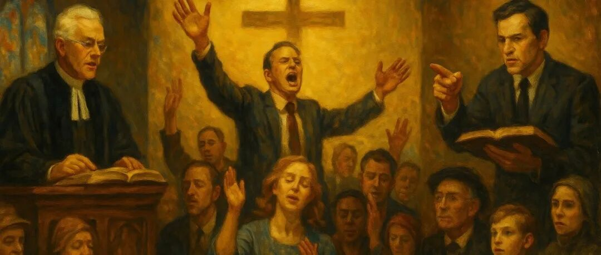

# 美国宗教的三大板块：主流新教、福音派与基要主义——谁才是“美国的上帝”的代言人？

> 发布日期: 2026-02-15

### 提到美国的宗教，人们常常首先想到**白人福音派**，以及他们在共和党政治中的巨大影响。但如果把历史时间轴拉长，你会发现，美国的宗教版图远比“福音派 vs 世俗化”复杂得多。

事实上，美国新教大致可以分为三大板块：

**主流新教（Mainline Protestantism）**

**福音派（Evangelicals）**

**基要主义（Fundamentalists）**

这三者既有交叉，又有明显区别。理解它们的起源、教义和社会角色，就能更清楚美国宗教与政治的互动逻辑。

### 一、主流新教：曾经的“美国正统”

在**19世纪到20世纪中叶**，美国的宗教中心其实并不是今天我们熟悉的“福音派”，而是所谓的**主流新教（Mainline Protestantism）**。

### 七大主流宗派（“七姐妹”）：

**公理会（Congregationalists）**→ 后来并入**基督联合教会（UCC）**

**长老会（Presbyterian Church, PCUSA）**

**圣公会 / 美国圣公会（Episcopal Church）**

**卫理公会（United Methodist Church, UMC）**

**路德宗（ELCA）**

**美国浸信会（ABCUSA）**（不同于保守的南方浸信会）

**基督联合教会（United Church of Christ, UCC）**

### 特点

**社会地位**：主导美国的教育、学术和政治精英（耶鲁、哈佛、普林斯顿等名校多源于这些宗派）。

**神学立场**：接受自由神学、圣经批判学，强调理性和社会伦理。

**社会影响**：推动废奴运动、劳工权益、民权运动，是美国自由主义价值的重要来源。

**政治倾向**：整体偏向民主党，重视社会正义与公共伦理。

👉 可以说，**主流新教是美国的“建制派宗教”**，塑造了制度、大学与上层社会的文化气质。

### 二、福音派：大众化与复兴的宗教

与主流新教的“建制派”风格不同，**福音派（Evangelicals）**从18世纪的大觉醒运动兴起，是一种更为大众化、情感化的宗教潮流。

### 起源

18世纪的复兴运动（大觉醒），代表人物有**乔纳森·爱德华兹、乔治·怀特菲尔德、约翰·卫斯理**。

强调个人皈依（“重生”）、圣经权威、情感化布道和积极传教。

### 特点

**信仰观**：圣经权威至上；必须“重生”；强调个人与上帝的直接关系。

**宗教风格**：大型布道会、复兴运动、热情洋溢的敬拜。

**社会基础**：最初多在边疆地区和普通民众，后来成为南方和中西部的主导力量。

**政治角色**：20世纪70年代后，白人福音派与共和党结盟，形成“宗教右派”，在反堕胎、反同性婚姻等议题上极具影响力。

👉 可以说，**福音派是美国宗教的“大众动员力量”**，代表了民粹化、复兴化的宗教传统。

### 三、基要主义：福音派中的“铁杆保守派”

**基要主义（Fundamentalism）**诞生于20世纪初，是福音派内部更为保守、极端的一支。

### 起源

1910–1915年出版的小册子合集**《The Fundamentals》**明确提出要坚守“基要真理”：

1910–1915年出版的小册子合集**《The Fundamentals》**明确提出要坚守“基要真理”：

圣经无误

耶稣神性与童贞女生子

基督代赎

耶稣复活

将来的再临

### 特点

**神学立场**：坚决捍卫圣经字面无误，反对自由神学。

**文化态度**：高度防御性，强调与“世俗世界”分离。

**社会表现**：1925年的“斯科普斯猴子审判”就是典型案例（基要派反对进化论进入课堂）。

**政治转型**：早期主张“退出政治”，但1970年代后与福音派一同进入共和党阵营，成为“宗教右派”的核心力量。

👉 可以说，**基要主义是福音派中的堡垒式群体**，比一般福音派更激进、更封闭。

### 四、三大板块的比较

特征主流新教 (Mainline)福音派 (Evangelicals)基要派 (Fundamentalists)**历史地位**19–20世纪精英“正统”18世纪大觉醒至今的大众宗教20世纪初的保守反动派**神学立场**自由神学、圣经批判圣经权威、个人重生圣经无误、反现代主义**宗教风格**理性、礼仪化、社会伦理热情布道、复兴运动防御性、分离主义**社会影响**建制派、大学、民权运动大众动员、南方和中西部的基层力量反进化论、宗教右派核心**政治倾向**偏民主党、社会正义偏共和党、保守议题偏共和党、极保守**身份定位**美国的“上层正统”美国的“大众力量”福音派中的“铁杆保守”

特征

主流新教 (Mainline)

福音派 (Evangelicals)

基要派 (Fundamentalists)

19–20世纪精英“正统”

18世纪大觉醒至今的大众宗教

20世纪初的保守反动派

自由神学、圣经批判

圣经权威、个人重生

圣经无误、反现代主义

理性、礼仪化、社会伦理

热情布道、复兴运动

防御性、分离主义

建制派、大学、民权运动

大众动员、南方和中西部的基层力量

反进化论、宗教右派核心

偏民主党、社会正义

偏共和党、保守议题

偏共和党、极保守

美国的“上层正统”

美国的“大众力量”

福音派中的“铁杆保守”

### 五、结语：多元与撕裂的背后

理解这三大板块，可以看出美国宗教与政治的复杂互动：

**主流新教**：塑造了美国制度和文化的“建制精英”传统。

**福音派**：凭借复兴热情与大众动员，成为美国当代最强的宗教力量。

**基要主义**：作为福音派的极端保守派，在共和党宗教右派中发挥着核心作用。

今天我们看到的“共和党与白人福音派结盟”，并不是美国历史的“正统回归”，而是**一个边缘化宗教传统在20世纪成功逆袭**的结果。

✨ 总结一句：**美国宗教的故事，不是单一的“基督教传统”，而是主流新教、福音派与基要主义三股力量此消彼长、彼此角力的故事。**