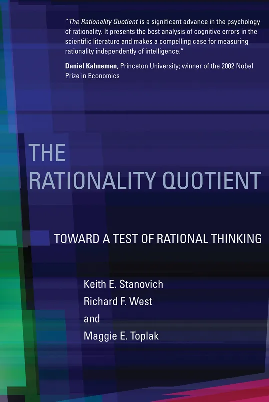

# 理商：迈向理性思维测试（2）

> 发布日期: 2026-02-14

转自“哲学社”

理商

迈向理性思维测试

基思·E·斯坦诺维奇（Keith E. Stanovich）

理查德·F·韦斯特（Richard F. West）

玛吉·E·托普拉克（Maggie E. Toplak）

麻省理工学院出版社 (The MIT Press)

马萨诸塞州，剑桥

英国，伦敦

2016

相关文章：

为什么我们总觉得对方“认知低”？

目录

前言

致谢

第一部分：理论基础 (Theoretical Underpinnings) | 1

第 1 章

：

哲学、认知科学与大众话语中的理性定义 | 3

理性的定义

在学术论述中，“

理性”（Rationality）

是一个既折磨人又饱受折磨的术语。它充满争议，且拥有众多的定义。许多学科都宣称对该术语拥有所有权，并对其进行了细微的差异化解析。哲学、经济学、决策理论、心理学——所有这些学科都使用了这一术语，并各有定义。例如，动物行为学家声称可以测量动物的理性程度（Kacelnik, 2006），然而根据其他学科使用的某些定义，动物根本不可能拥有理性。

跨学科的学者们仅在一个观点上达成了一致：

理性的定义有很多，且随学术领域的不同而异。

例如，经济学家罗伯特·弗兰克（Robert Frank, 2004）承认：“理性的概念有很多种，各有优缺点。关于理性的模糊性，很大程度上源于一个简单的事实：没有任何一个单一的概念能够战胜竞争对手并占据主导地位”（第 45 页）。哲学家苏珊·赫利（Susan Hurley）和马修·纳兹（Matthew Nudds, 2006）也同样认为：“在应用于人类时，不同学科在不同意义上使用‘理性’；有些侧重于理性行为，有些侧重于理性过程，这与它们不同的假设和目的相一致。因此，在跨学科讨论中存在着‘各说各话’（talking at cross purposes）的危险”（第 6 页）。

跨学科的问题已经足够棘手，甚至在心理学这一个学科内部，与理性相关的术语和区分也趋于泛滥。我们无意对所有定义逐一评论，只是希望借此说明：有必要划定我们在本书中是如何使用这一术语的。我们无法在这里解决每一个关于理性的哲学问题。相反，我们对术语和定义的偏好是由我们的总体任务决定的：

即展示一套完整的

“理性思维综合测试”

雏形应该是怎样的。

我们对理性的构想将借鉴

决策理论和认知科学

，因为对于一个评估工具而言，我们显然需要一个

基于经验且具有操作性基础

的概念。那些未落实在经验基础上的哲学构想，对于构建理性思维测试而言基本是徒劳的。此外，我们需要一个允许

个体差异

的理性定义——即理性思维和理性反应是一个

从“高度理性”到“较低理性”的连续体，而人与人之间在此存在差异。

相比之下，许多哲学上的理性概念旨在将所有人等同视之——从而根据定义，一笔勾销了我们恰恰想要研究的个体差异。

尽管如此，许多人已经习惯了那种将所有人的理性思维等同视之的哲学定义。这些定义已经进入大众话语，可能会对我们所使用的用法造成混淆。无论读者此前是否熟悉有关“理性”一词的讨论，我们都敦促大家不要纠结于特定的术语。如果您不喜欢本书任何部分对该词的使用，只需将其替换为

“优秀的思维”（good thinking）

，其核心意义完全不会受损。

本书所使用的“理性”强定义

“理性”一词有

“强”和“弱”

两种意义。无论是在外行还是学者之间，事情往往从一开始就出错了，因为对他们来说，该词的弱意义更为常见，而在经验科学家中，强意义才是通用的。

强意义上的理性是认知科学中所使用的定义，也是我们在本书中贯穿始终的定义。

相比之下，

词典中对理性的定义往往属于弱定义——通常显得相当乏力和笼统，例如，“与理智保持一致的状态或品质”。

理性的弱定义源于亚里士多德的一种分类学观点，他假定人类是唯一根据理性采取行动的动物。正如德·索萨（de Sousa, 2007）指出的，

这种“基于理智”的理性概念，其对立面不是“非理性”（irrationality），而是“无理性”

（arationality）。亚里士多德的刻画是分类式的——一个有机体的行为要么基于思考，要么就不属于理性的范畴。在这种观念中，人类是理性的，其他动物则不是。这种观点没有为人类个体之间理性思维的差异留出空间。

在更强的意义上——即认知科学及本书所采用的意义上——理性是一个

规范性

（normative）

概念。关于最优判断和决策的规范性模型，以认知科学中使用的非分类方式定义了理性。因此，理性是有

程度

之分

的，由思维或行为与规范性模型所定义的

“最优状态”

之间的

距离

来决定（Etzioni, 2014）。因此，当认知科学家称某种行为为“非理性”时，他/她的意思是该行为偏离了特定规范性模型所规定的最优路径。科学家并不是在暗示该行为背后完全没有思想或推理。

实验声称人类具有非理性，这引发了一些敌意，毫无疑问，部分敌意源于亚里士多德观点的（或许是潜意识的）影响——即假设当认知心理学家说某些人行为

非理性

时，是在说这些人某种程度上

“不够健全的人”（less than human）

。因此，

“非理性”

一词在民间语言中被编码为一种特别严重的

侮辱

。我们在这里的观点是，心理学家并不是在以这种方式使用该术语。他们采用的是另一种理性定义，

即所有人都是

完全的人

，但尽管如此，他们的

理性倾向

可能

存在差异

。

对于普通人来说，亚里士多德分类观点的残余联想，很可能使“非理性”这个词听起来比实际意义更伤人。作为认知科学家，我们可以做得更好，以明确我们在科学中使用的是非分类的、连续意义上的“理性”和“非理性”。当我们发现一种不够理想的理性行为模式时，我们可以轻松地说它是

“不够完美的理性”，而不是“非理性”

——这样做不会损失任何原意。如果这在文献中已成为习惯，或许认知科学领域关于理性的“大辩论”（Bishop & Trout, 2005; Cohen, 1981; Kelman, 2011; Stanovich, 1999, 2004; Stein, 1996; Tetlock & Mellers, 2002）也就不会变得如此激烈了。出于这个原因，我们在本书中将

谨慎使用“非理性”一词

。相反，我们的

重点是理性反应的

连续变化

，

其程度从

完美理性

一直延伸到

越来越低的理性

反应。

心理学家不采用理性的分类定义，另一个原因在于这种定义无法为认知改良或认知改变提供动力。

理性的连续定义能够激励认知改良，因为大多数人都不是完美或最优理性的；大多数人都可以提高他们的理性思维倾向。

但是，采用认知科学的连续定义——即激励认知改良的定义——必然需要指称某些人比其他人更理性（至少在逐项任务的基础上）。这与说某些人比其他人更聪明没有区别。智力上的差异划分了一个无疑存在重叠、但确实不同的认知空间。人们在智力上确实存在差异，正因为能够测量这种差异，心理学家才能够设计出让人们变得更聪明的方法。同样地，人们在理性上确实存在差异，认知科学已经发现了许多让人们变得更理性、从而在生活中获得更积极成果的方法。例如，我们可以教人们做出更好的财务决策，教医生做出更好的医疗决策，并向教育工作者建议如何做出更好的教育决策。

理性：工具性与认识性

如前所述，词典中对理性的定义（“拥有理智”）往往过于软弱，且不够具体，以至于无法进行测试。此外，出于各种原因，一些作者刻意宣传一种被扭曲的理性形象，因为他们希望贬低理性的重要性。一种常见的伎俩是暗示理性只不过是解决“哲学 101”课程中遇到的三段论推理问题的能力。相比之下，现代认知科学中理性的含义要全面、稳健且重要得多。

我们追随许多认知科学理论家的观点，认可两种类型的理性：

工具理性

（Instrumental Rationality）和

认识理性

（Epistemic Rationality）（Manktelow, 2004; Over, 2004）。

工具理性最简单的定义是：

在给定可用资源（物理资源和心理资源）的情况下，在世界中采取行动，以便准确获得你最想要的东西。从稍显技术的角度来看，我们可以将工具理性描述为个体目标达成度的最优化。经济学家和认知科学家已经将“目标达成最优化”这一概念细化为“期望效用”（Expected Utility）这一专业术语。

另一种理性，即

认识理性

，关注的是我们的信念与世界的实际结构契合到何种程度。认识理性有时被哲学家称为

“理论理性”或“证据理性”

。同样地，

工具理性

有时被称为

“实践理性”

。当然，这两类理性是相互关联的；为了采取能实现目标的行动，我们需要将这些行动建立在与世界妥善匹配的信念之上。

当认识理性和工具理性被妥善定义时，事实上没有人会希望避开它们。大多数人希望他们的信念能与现实保持某种对应，同时也希望以能帮助他们实现目标的方式行事。曼克特洛（Manktelow, 2004）通过指出这两者关乎两个关键问题，强调了这两类理性的实用性：

什么是真实的（what is true）

以及

该做什么（what to do）

。

认识理性关乎什么是真实的，而工具理性关乎该做什么。

为了让我们的信念具有理性，它们必须对应世界的存在方式——它们必须是真实的。为了让我们的行动具有理性，它们必须是实现目标的最佳手段——它们必须是该做的最佳事情。对于一个人的生活而言，没有任何东西能比那些帮助他们发现

“什么是真实的”以及“什么是最好做的”

思维过程更实用或更有用了。

更正式地说，经济学家和认知科学家将工具理性定义为

预期效用最大化

。要具备工具理性，一个人必须在多种选项中做出选择，其依据是哪一个选项具有最大的预期效用。决策情境可以分解为三个组成部分：

(1) 可能的行动；

(2) 世界可能的各种状态；

(3) 对每种可能状态下可能行动所产生后果的评估。

预期效用的计算方法是：取每一个结果的效用，乘以该结果发生的概率，然后将所有可能结果的这些乘积相加。

理性选择的公理化方法

在实践中，以这种计算方式（指上一段提到的乘法累加计算）来评估理性可能非常困难，因为诱导出个体内心真实的“个人概率”十分棘手。此外，在实验中测量各种后果的效用也存在技术困难。幸运的是，还有另一种有效的方法可以衡量决策的理性程度以及对理性的偏离。多项形式化分析已经证明，如果人们的偏好遵循某些一致的模式（即所谓的

选择公理

，axioms of choice），那么他们的行为表现就

等同于

正在进行效用最大化（Dawes, 1998; Edwards, 1954; Jeffrey, 1983; Luce & Raiffa, 1957; Savage, 1954; von Neumann & Morgenstern, 1944）。

这些分析引出了所谓的判定人们是否在进行效用最大化的

“公理化方法”

。这种方法使我们能够通过认知科学的实验手段，更轻松地测量人们的理性程度。根据公理，对最优选择模式的偏离就是一种（反向）衡量理性程度的尺度——

一个人偏离最优选择模式越远，其理性程度就越低。

选择的公理化方法将工具理性定义为对某些类型的一致性和连贯性准则的遵循。例如，其中一个公理是

传递性

（transitivity）：如果你偏好 A 胜过 B，且偏好 B 胜过 C，那么你就应当偏好 A 胜过 C。违反传递性是对理性的一种严重违背，因为它会导致决策理论家所说的“

金钱泵

”（money pump）效应——在这种情况下，如果你根据这种不具有传递性的偏好采取行动，你的全部财富都可能被抽干（Schick, 1986）。

公理化方法将一个效用最大化者的特征描述为：对决策情境中呈现的每个选项都拥有稳定的、潜在的偏好。它假设一个最优理性的人对可用选项的偏好在选择公理方面是完备的、有序的且表现良好的（Thaler, 2015）。所有的选择公理（无关选项的独立性、传递性、独立性、复合博弈的简化等）都以这样或那样的方式确保决策

不受无关情境的影响

（Stanovich, 2013）。由于每种偏好的强度——即该选项的效用——在选项呈现之前就已经存在于大脑中，因此呈现方式的任何情境因素都不应影响偏好。如果我们的偏好受到无关情境的影响，那么我们的偏好就不可能是稳定的，我们也无法实现效用最大化。因此，

我们的思维在多大程度上独立于无关情境，就成了衡量理性思维的一个重要指标，并将在我们的评估工具包中占据突出位置。

认知科学中大量的经验证据表明，人们有时会违反这些效用理论的公理（Kahneman & Tversky, 2000; Thaler, 2015）。众所周知，人们在遵循界定工具理性的基本选择公理的倾向方面存在广泛差异。

我们也可以使用公理化方法来评估认识理性。回想一下，行动的预期效用涉及将结果的概率乘以其效用，并对所有可能的结果求和。因此，确定最佳行动涉及对各种结果概率的估算。当然，这些概率并不是有意识的计算——它们是我们对世界状态的信心估计。它们是我们的信念以及我们对这些信念的信心。如果我们对世界状态的概率判断是错误的，决策就无法实现效用最大化——我们的行动将无法导致我们获得最想要的东西。

因此，工具理性和认识理性变得交织在一起。如果我们要确定该做什么，我们需要确保我们的行动是基于真实情况的。正是在这种意义上，

信念的理性——认识理性——是行动理性的基础之一。

信念的理性是通过考察各种概率推理技能、证据评估技能和假设检验技能来评估的。

对于一个具备认识理性的人来说，他的概率估计必须遵循客观概率规则。也就是说，他的估计必须遵循所谓的

概率演算

（probability calculus）。在数学上，概率值遵循某些规则。这些规则构成了主观概率估计最重要的规范性模型之一。正如工具理性的情况一样，认知心理学中一个重要的研究传统已经表明，人们有时会违反许多认识理性的规则。

理性与“启发式和偏见”文献

在构建我们的理性思维评估工具时，我们借鉴了大量证明了人类违反工具理性和认识理性

规范性模型

（normative models）的文献。一套庞大的研究文献——包含了几十年间进行的数百项经验研究——已经牢固地确立了一个事实：

在许多推理任务中，人们的反应有时会偏离被视为规范的表现。

例如，人们会错误地评估概率，低效地检验假设，违反效用理论的公理，无法正确校准信念程度，其选择受到无关情境的影响，在评估数据时忽略替代假设，并表现出许多其他信息加工偏见（Baron, 2008, 2014; Evans, 2014; Kahneman, 2011; Kahneman & Tversky, 2000; Koehler & Harvey, 2004; Manktelow, 2012; Thaler, 2015）。我们将大量引用这些研究，特别是

卡尼曼（Kahneman）和特沃斯基（Tversky）

在 20 世纪 70 年代初开创的所谓“

启发式和偏见

”传统（Kahneman & Tversky, 1972, 1973; Tversky & Kahneman, 1974）。

“

偏见

”（biases）一词是指人们在选择行动和估计概率时所犯的系统性错误；而“

启发式

”（heuristic）一词则解释了人们为什么经常犯这些错误——因为他们使用

心理捷径（启发式）

来解决许多问题。我们将在本书的几个章节中讨论这些心理捷径的心理学理论。表 1.1 列出了我们实验室研究过的一些任务、效应和偏见，我们从中筛选并构建了

“理性思维综合评估”（CART）

。

表 1.1 斯坦诺维奇/韦斯特/托普拉克实验室研究的启发式与偏见任务个体差异采样

任务、效应与偏见

该实验室关于个体差异的研究引用

基础概率忽略 (Baserate Neglect)

Kokis et al. (2002); Stanovich & West (1998c, 1998d, 1999, 2008b); West et al. (2008)

合取谬误 (Conjunction Fallacy)

Stanovich & West (1998b); Toplak et al. (2011); West et al. (2008)

框架效应 (Framing Effects)

Stanovich & West (1998b, 1999, 2008b); Toplak et al. (2014a, 2014b)

锚定效应 (Anchoring Effect)

Stanovich & West (2008b)

样本量意识 (Sample Size Awareness)

Toplak et al. (2011); West et al. (2008)

均值回归 (Regression to the Mean)

Toplak et al. (2007, 2011); West et al. (2008)

对照组推理 (Control Group Reasoning)

Stanovich & West (1998c); Toplak et al. (2011); West et al. (2008)

析取推理 (Disjunctive Reasoning)

Toplak & Stanovich (2002); West et al. (2008)

跨期折扣 (Temporal Discounting)

Toplak et al. (2014a)

赌徒谬误 (Gambler’s Fallacy)

Toplak et al. (2007, 2011); (West et al. (2008)

概率匹配 (Probability Matching)

Stanovich & West (2008b); Toplak et al. (2007, 2011); West & Stanovich (2003)

过度自信效应 (Overconfidence Effect)

Stanovich & West (1998c)

结果偏见 (Outcome Bias)

Stanovich & West (1998c, 2008b); Toplak et al. (2007, 2011)

比例偏见 (Ratio Bias)

Kokis et al. (2002); Stanovich & West (2008b); Toplak et al. (2014a, 2014b); West et al. (2008)

四卡片选择任务 (Four-Card Selection Task)

Stanovich & West (1998a, 2008b); Toplak & Stanovich (2002); Toplak et al. (2014a); West et al. (2008)

忽略 P(D/~H)

Stanovich & West (1998d, 1999); West et al. (2008)

沉没成本效应 (Sunk Cost Effect)

Stanovich & West (2008b); Toplak et al. (2011)

风险-收益混淆 (Risk-Benefit Confounding)

Stanovich & West (2008b)

相关性检测 (Covariation Detection)

Stanovich & West (1998c, 1998d); Sá et al. (1999); Toplak et al. (2011); West et al. (2008)

三段论推理中的信念偏见 (Belief Bias in Syllogistic Reasoning)

Macpherson & Stanovich (2007); Stanovich & West (1998c, 2008b); Toplak et al. (2014a, 2014b)

遗漏偏见 (Omission Bias)

Stanovich & West (2008b)

非正式论证评估 (Informal Argument Evaluation)

Stanovich & West (1997, 2008b); Sá et al. (1999)

非混淆假设检验 (Unconfounded Hypothesis Testing)

Stanovich & West (1998c); Toplak et al. (2011)

我方立场偏差 (Myside Bias)

Sá, Kelley, Ho, & Stanovich (2005); Stanovich & West (2007, 2008a, 2008b); Toplak & Stanovich (2003); Toplak et al. (2014a, 2014b)

期望值最大化 (Expected Value Maximization)

Stanovich, Grunewald, & West (2003); Toplak et al. (2007)

纽康姆难题 (Newcomb’s Problem)

Stanovich & West (1999); Toplak & Stanovich (2002)

囚徒困境 (Prisoner’s Dilemma)

Stanovich & West (1999); Toplak & Stanovich (2002)

后视偏差 (Hindsight Bias)

Stanovich & West (1998c)

单面偏见 (One-side Bias)

Stanovich & West (2008a)

确定性效应 (Certainty Effect)

Stanovich & West (2008b)

支付意愿/接受意愿 (Willingness to pay/Willingness to accept)

Stanovich & West (2008b)

偏见盲点 (Bias Blind Spot)

West, Meserve, & Stanovich (2012); Toplak et al. (2014a)

可评估性：少即是多效应 (Evaluability: Less is More Effect)

Stanovich & West (2008b)

比例支配效应 (Proportion Dominance Effect)

Stanovich & West (2008b)

几乎所有的研究心理学家都承认，由屡获殊荣的

“启发式与偏见”

研究所标注出的

认知空间

具有重要意义。2002年颁发给

丹尼尔·卡尼曼（Daniel Kahneman）

的诺贝尔奖新闻稿中，特别提到了他的工作根植于

“认知心理学家对人类判断和决策的分析”

。这项工作因其“激励了新一代经济学和金融学研究者，利用认知心理学对人类内在动机的洞察来丰富经济理论”而受到赞誉（瑞典皇家科学院，2002a, 2002b）。

这项工作之所以如此具有影响力，原因之一是它探讨了关于人类理性的深刻问题。正如诺贝尔奖公告所指出的，

“卡尼曼和特沃斯基发现了不确定性下的判断是如何系统性地偏离传统经济理论所假设的那种理性”

（瑞典皇家科学院，2002a, 2002b）。因此，卡尼曼和特沃斯基揭示的思维错误并非社交游戏中的琐碎失误。具备理性意味着使用尽可能好的手段去采取行动，以实现个人的人生目标。因此，违反这项诺奖研究中所审视的思维规则，会产生实际的后果，即我们对生活的满意度可能会低于本可以达到的水平。

认知科学家

史蒂芬·平克（Steven Pinker）

支持诺贝尔委员会的观点，他认为，当“试图确定在整个知识领域中任何受过教育的人都应该知道什么时……关于人类认知和概率推理的研究应当作为任何受过教育的人首先应了解的事物之一。我对其重要性的尊重是毫无保留的”（创意领导力论坛，2011）。我们同意平克的观点，即这些思维领域是每个受过教育的人都应该了解的，而他的陈述为理解我们在理性思维综合评估（CART）中所创造的东西提供了一种方式。

平克认为“任何受过教育的人在整个知识领域中都应该知道”的东西，恰恰就是我们试图评估的内容！

判断和决策的技能是理性思维和行动基础的认知技能，而它们

在智力测试中是缺失的

。

那么，这本书以及我们开始构建的评估工具，可以被视为对行为科学中最深刻的历史讽刺之一的部分补救：

诺贝尔奖授予了对认知特征的研究，而这些特征在行为科学中最著名的心理评估设备——智力测试中完全缺失（Stanovich, 2009）。

我们希望 CART 至少能部分纠正我们学科在对待不同认知特征时所表现出的这种奇怪异常。

由于我们理性思维框架的许多操作化工作源于“启发式与偏见”传统，因此有必要根据当代人类心灵功能架构的理论来阐明其任务逻辑。在下一章中，我们将概述我们将用于解释这些文献中任务的功能认知理论。在第3章中，我们将根据这种架构拆解启发式与偏见任务的逻辑。一旦架构被揭示，前言中的一个关键点就会变得清晰。具体而言，

我们将展示理性概念和智力概念是两个不同的事物。更具体地说，我们将展示理性实际上是一个比智力更包容的心理构念。

因此，作为理性的衡量标准，“启发式与偏见”文献中的任务虽然部分涉及了智力，但实际上比智商（IQ）测试所评估的包含了更多的认知过程和知识。

总结

由于理性是一个跨多个学科的问题，它获得了许多不同的定义。其中一些定义实际上阻碍了评估与判断和决策相关的重要心理机能中个体差异的目标。不出所料，我们从认知科学中选择了适合我们衡量个体差异计划的理性定义。这些定义具有经验基础，且数据表明，当我们以大多数认知科学家的方式衡量理性时，存在显著的个体差异。

阐述我们逻辑的另一种方式是：如果你打算衡量理性思维中的个体差异，你就必须以我们所采用的方式来定义它。任何研究者都可以自由地以其他方式定义理性，但重点是，我们正在研究的这些个体差异依然存在。到那时，我们只需要给它们换一个名字即可。在某种意义上，这并不会引起我们的反对，但有一个重要的告诫。

任何反对将我们在后续章节中展示的大量启发式与偏见任务冠以“理性”之名的人，绝对不应将这些衡量标准称为智力的一部分。现有的智商（IQ）测试并不衡量这些内容，且智商测试在预测这些推理过程中的个体差异方面并不完美。因此，我们更倾向于将我们的测量工具默认称为“理性思维测量”。正如我们在第 2 章中将论证的那样：你可以尽管把它称为别的什么，只是别把它称为智力。

第 2 章

：理性、智力与心灵的功能架构 | 15

第 3 章

：克服吝啬化加工：检测、覆盖与心智程序 | 39

第 4 章

：理性思维综合评估（CART）框架 | 63

第二部分：CART 评估的理性思维组件 | 75

第 5 章

：概率与统计推理 | 77

第 6 章

：科学推理 | 97

第 7 章

：避免吝啬的信息加工：直接测试 | 111

第 8 章

：避免吝啬的信息加工：间接效应 | 141

第 9 章

：概率算术能力、金融素养、期望值敏感度与风险知识 | 177

第 10 章

：受污染的心智程序 | 191

第 11 章

：理性的倾向与态度 | 207

第三部分：理性思维综合评估：数据与结论 | 217

第 12 章

：各分测试间的关联：简版 CART | 219

第 13 章

：各分测试间的关联：完整版 CART | 233

第 14 章

：CART 的背景、告诫与疑问 | 269

第 15 章

：理性思维测试的社会与实践意义 | 297

附录

：理性思维综合评估（CART）各分测试与量表的结构及样本题目 | 331

注释

 | 369

参考文献

 | 379

作者索引

 | 441

主题索引

 | 455